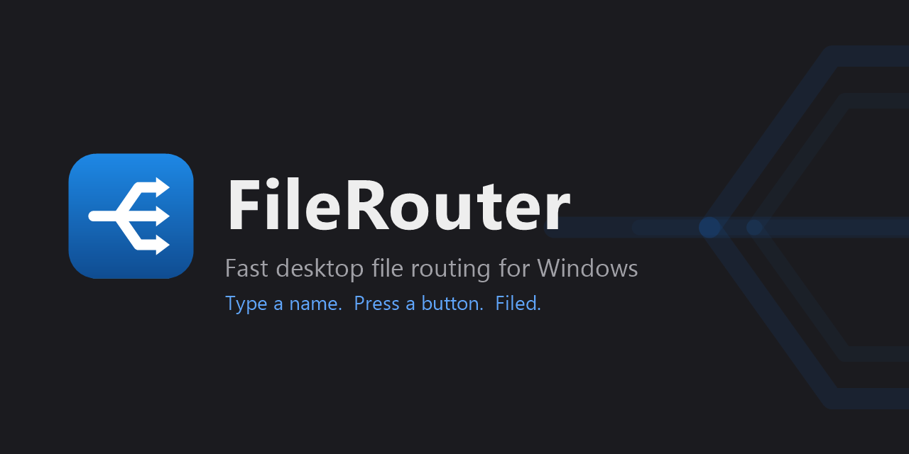

<p align="center">
  
</p>

# FileRouter

A fast Windows desktop tool for **file routing**: name incoming documents and
send them to the right folder in two actions — type a name, press a button.

FileRouter watches an inbox folder. Each arriving PDF opens in a built-in
viewer; you type the name it should carry, press one of your destination
buttons (or its hotkey), and the file is renamed and moved. A dashboard shows
what's waiting, monitored folders light up when they need attention, and every
move is written to a tamper-evident audit log.

Built with C# / .NET 8 + WPF. PDFs render in **WebView2** (Edge's engine,
already on the machine), so no PDF library ships with the app.

## Download

Portable builds are attached to every [release](../../releases) (and every CI
run uploads one under the run's Artifacts):

- **`FileRouter-vX-win-x64.zip`** (~5 MB) — a single exe; needs the .NET 8
  Desktop Runtime, which modern Windows 10/11 machines already have (Windows
  offers the download link if it's missing).
- **`…-selfcontained.zip`** (~70 MB) — carries the runtime; nothing to
  install.

Unzip anywhere and run — the app reads (or creates on first run) a
`config.json` beside the exe, or takes `--config <path>`. Locally,
`publish.bat` builds the same portable exe into `publish\`.

To cut a release: `git tag v1.0.0 && git push origin v1.0.0` — the Release
workflow tests, builds, zips, and publishes.

## Design goals

- **Small.** No bundled browser, no bundled PDF renderer, no MVVM framework —
  the app's own code is a few hundred KB.
- **Network-safe.** The audit database uses a rollback journal (never WAL,
  which corrupts over SMB) with a `busy_timeout`, so several workstations can
  file into one `history.sqlite` on a share. A 30-second poll backstops folder
  watching where SMB drops change notifications.
- **Never loses a file.** Files are only ever *moved*, never deleted or
  overwritten; a taken name gets a Windows-style ` (2)` counter. Illegal
  filename characters are rejected up front — a colon would otherwise hide a
  document in an NTFS alternate data stream.
- **Looks after the eyes.** Follows Windows light/dark mode live (or force
  either); every text color pairing in the theme is enforced to WCAG AA 4.5:1
  **by a unit test**; app font and text size are configurable.

## Features

- **The routing loop** — Ready → Processing → Done. Live inbox monitoring
  (new arrivals join a running session), a live "will be filed as" preview
  that flags illegal names before you commit, name autocomplete ranked by
  recency then frequency (Tab completes a word at a time), uppercase and
  word-separator polishing, and a color-coded confirmation card after every
  routing. Commit, set-aside, and undo are reentrancy-guarded — a fast
  double-press can never mislabel a document.
- **Two naming modes** — *Insert at the `--`*: any filename containing `--`
  gets the typed name spliced at the first one (`REPORT--1042.pdf` + SMITH
  JOHN → `REPORT-SMITH JOHN-1042.pdf`); or *Full replace*. Per-route
  overrides, filename suffixes, and real config-driven hotkeys.
- **Dashboard** — a compact window parked in the corner of your screen that
  sizes itself to its content: a big inbox count, plus a grid of monitored
  folder tiles that appear only while a folder holds matching files. Filename
  alert terms flash a tile (and the count) red, and alerts found in
  subfolders say which one.
- **Viewer gestures** — Shift+scroll zooms at the cursor, left-drag pans.
- **History** — a network-safe SQLite audit log with daily point-in-time
  backups, an in-app viewer (filter, lazy load), and CSV export with a
  formula-injection guard.
- **Settings** — six sectioned pages with live previews everywhere: route
  buttons render exactly as they'll appear, dashboard tiles preview against
  the real folder, naming choices show a worked example, and validation
  happens as you type. Unknown hand-edited config keys always survive.
- **Tools** — *Unlock PDFs* (verified in-place decrypt or suffixed copies,
  saved passwords DPAPI-encrypted per Windows account), *Bulk rename*
  (find/replace, affixes, case, hand-editable preview, batch undo), and
  *Match & merge* (pair PDFs against a roster CSV by name and merge each
  person's ID into the filename, with a side-by-side Triage view for
  ambiguous matches).

## Structure

```
src/FileRouter.Core/     pure logic — no UI, unit-tested
  Naming.cs              filename construction + reserved-char guard
  BulkRename.cs          batch rename + the review-file name parser
  MatchMerge.cs          roster CSV matching + ID merge
  Config.cs  Scanner.cs  Commit.cs  Session.cs
  History.cs             network-safe SQLite audit log
src/FileRouter.Wpf/      the app: MVVM view models (headless-tested) + XAML
  Theme/                 WCAG-enforced light/dark palette, live OS switching
  ViewModels/ Views/ Windows/
tests/FileRouter.Core.Tests/   xUnit — the routing rules, adversarially
tests/FileRouter.Wpf.Tests/    xUnit — the whole app logic, headless
tools/FileRouter.Smoke/        UI proofs against the real WebView2 viewer
```

## Build & test

```
dotnet build
dotnet test
```

## Run the demo

Run `reset.bat` once to generate a demo workspace (sample PDFs, two routes,
a monitored folder), then launch with `run.bat`, or:

```
dotnet run --project src/FileRouter.Wpf -- --config demo\config.json
```
